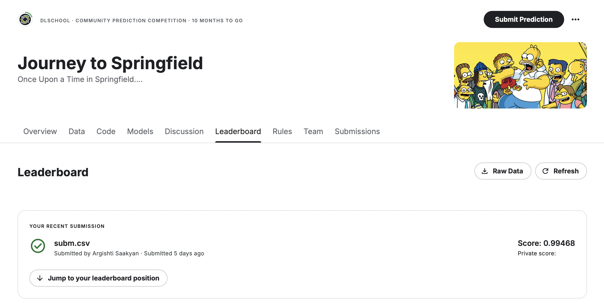

Оформляю этот проект не в виде ноутбука, а в виде полноценного проекта, как это делаю в боевых задачах (в упрощенном виде). Всё настраивается в конфиг файле, потом отдельно зпускаются нужные операции (препроцессинг, сплит, обучение, предикт). Настроены локальные логи и wandb. Можно почиать про то, как я обычно провожу эксперименты [здесь](https://medium.com/towards-artificial-intelligence/guide-to-pytorch-experiments-e84efa984f45)

## Usage
To run the scripts, use the following commands:
```bash
python -m src.etl.preprocess   # Converts images and PDFs to JPG format
python -m src.etl.split        # Creates train, validation, and test CSVs with image paths
python -m src.dl.train         # Runs the training pipeline
python -m src.dl.infer         # Runs inference and creates csv
```


